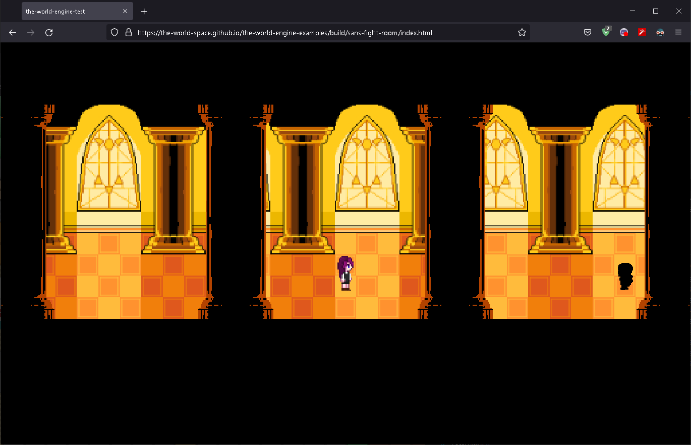

# the-world-engine.ts
 three.js based, unity like game engine for browser.

#### [Demo](https://the-world-space.github.io/the-world-engine-examples/build/sans-fight-room/index.html)

### Build your scene on Object hierarchy system

### Scripting your component to attach GameObject

## Component Features
#### Messages
- awake()
- start()
- update()
- onEnable()
- onDisable()
- onDestroy()

#### Others
- coroutine
- change script execution order
- require components
- disallow multiple components
  
  All features have a similar or same behavior to [Unity Game Engine](https://docs.unity3d.com/ScriptReference/MonoBehaviour.html).

## Examples
- [the-world-engine-examples](https://github.com/The-World-Space/the-world-engine-examples)
