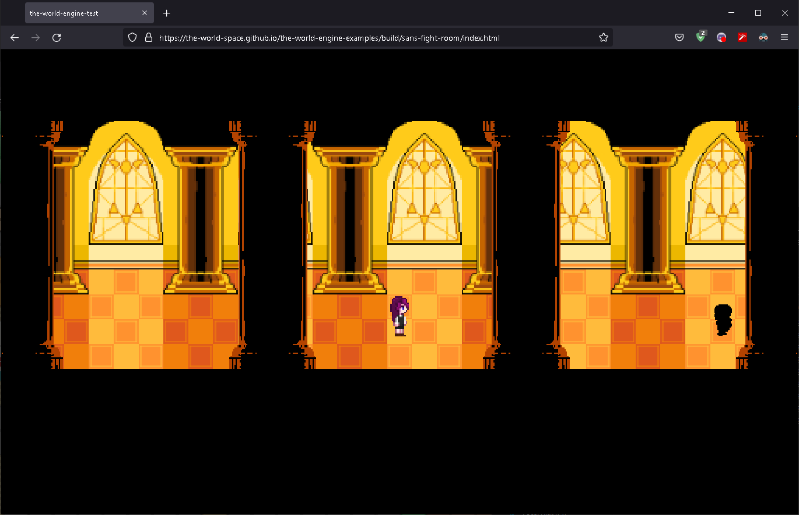

# the-world-engine.ts
<!-- ALL-CONTRIBUTORS-BADGE:START - Do not remove or modify this section -->
[](#contributors-)
<!-- ALL-CONTRIBUTORS-BADGE:END -->
 three.js based, unity like game engine for browser.

[](https://www.npmjs.com/package/the-world-engine) [](https://app.codecov.io/gh/The-World-Space/the-world-engine.ts/) [](https://github.com/The-World-Space/the-world-engine.ts/commits/dev) [](https://www.typescriptlang.org/) [](https://opensource.org/licenses/MIT)

```shell
npm i the-world-engine
```

#### [Demo](https://the-world-space.github.io/the-world-engine-examples/build/sans-fight-room/index.html)



### Build your scene on Object hierarchy system


### Scripting your component to attach GameObject


## Examples

- [the-world-engine-examples](https://github.com/The-World-Space/the-world-engine-examples)

## Documentation

- [Documentation](https://the-world-space.github.io/the-world-engine.ts/build) - I'm still working on it

## Contributers

<!-- ALL-CONTRIBUTORS-BADGE:START - Do not remove or modify this section -->

<!-- ALL-CONTRIBUTORS-BADGE:END -->

<!-- ALL-CONTRIBUTORS-LIST:START - Do not remove or modify this section -->
<!-- prettier-ignore-start -->
<!-- markdownlint-disable -->
<table>
  <tr>
    <td align="center"><a href="http://zly201.github.io"><br /><sub><b>Zilong Yao</b></sub></a><br /><a href="https://github.com/The-World-Space/the-world-engine.ts/commits?author=ZLY201" title="Code">💻</a></td>
  </tr>
</table>

<!-- markdownlint-restore -->
<!-- prettier-ignore-end -->

<!-- ALL-CONTRIBUTORS-LIST:END -->

## Contributing

Please see the [Contributing Guidelines](./CONTRIBUTING.md) for guidelines on how to contribute to the project.

## Contributors ✨

Thanks goes to these wonderful people ([emoji key](https://allcontributors.org/docs/en/emoji-key)):

<!-- ALL-CONTRIBUTORS-LIST:START - Do not remove or modify this section -->
<!-- prettier-ignore-start -->
<!-- markdownlint-disable -->
<!-- markdownlint-restore -->
<!-- prettier-ignore-end -->
<!-- ALL-CONTRIBUTORS-LIST:END -->

This project follows the [all-contributors](https://github.com/all-contributors/all-contributors) specification. Contributions of any kind welcome!