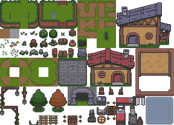
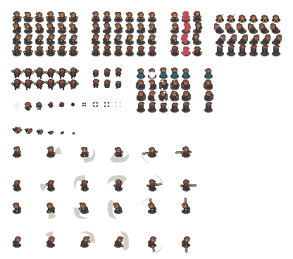

import DocumentGame from "@site/src/components/DocumentGame";
import { Bootstrapper, Bootstrapper2, Bootstrapper3 } from "./project-override/3-sprite-atlas-setup";

# Sprite Atlas Setup

Sprite Atlas can be used right away to reduce the load time of the game and make the game easier to manage.

we will download Sprite Atlas and prepare for use.

## Donload Sprite Atlas

First, **download the game assets** that we will use. 

We're going to use the [TOP-DOWN Adventure Pack](https://o-lobster.itch.io/adventure-pack) But there's a slight flaw in the original,
so We'll use the revised version

you can **download** the revised version from the
**[here](https://download-directory.github.io/?url=https%3A%2F%2Fgithub.com%2FThe-World-Space%2Fthe-world-engine-examples%2Ftree%2Fmain%2Ftopdown2d%2Fsrc%2Fasset%2Fimage)**.

put the contents of the downloaded folder into the src/asset/image of the project.



We will try level design using `Overworld_Tileset.png` among the downloaded files.



And we will make a player with `Char_Sprites/char_spritesheet.png`.

## Indexing Sprite Atlas

Like the picture above, the image made by combining various images is called Sprite Atlas.

We're going to cut and use only the parts we want over there.

**The following considerations should be taken** to properly cut the image:

- row count and column count of the image
- image should not have inconsistent size
- image should not have inconsistent padding
- you must know the index of the image you want to use

For example, **`Overworld_Tileset` image has row count of 13 and column count of 18**.

Then, let's render the image with `Overworld_Tileset.png`.

### Use `CssSpriteAtlasRenderer`

Load the image with proper row and column count.

```typescript title="src/asset/Bootstrapper.ts"
import OverworldTileset from "./image/Overworld_Tileset.png";
//...
.withChild(instantiater.buildGameObject("test-sprite-atlas")
    .withComponent(CssSpriteAtlasRenderer, c => {
        c.asyncSetImageFromPath(OverworldTileset, 18, 13);
        c.imageWidth = 1;
        c.imageHeight = 1;
        c.viewScale = 1;
    }))
    
.withChild(instantiater.buildGameObject("camera")
//...
```

<DocumentGame bootstrapper={Bootstrapper} ignoreEvents/>

The top leftmost tile of the Sprite Atlas was rendered.

Sprite Atlas has a property called imageIndex, which, as the value increases,
selects tiles to render from left to right, top to bottom.

So **we need to indexing the image to choose which tiles to use**.

### Draw ImageIndex

Let's try scripting the index drawing.

```typescript title="src/asset/script/DrawIndex.ts"
import { Color, Component, CssTextRenderer } from "the-world-engine";
import { Vector2, Vector3 } from "three/src/Three";

export class DrawIndex extends Component {
    public column = 18;
    public row = 13;

    public awake(): void {
        for (let i = 0; i < this.row; i++) {
            for (let j = 0; j < this.column; j++) {
                this.spawnText(new Vector2(j + 0.5, this.row - 1 - i), i * this.column + j);
            }
        }
    }

    private spawnText(pos: Vector2, index: number): void {
        this.engine.scene.addChildFromBuilder(
            this.engine.instantiater.buildGameObject("text", new Vector3(pos.x, pos.y, 10))
                .withComponent(CssTextRenderer, c => {
                    c.text = index.toString();
                    c.textColor = new Color(0, 0, 0);
                    c.viewScale = 0.05;
                })
        );
    }
}
```

to use simple for loop to spawn text.

```typescript title="src/asset/Bootstrapper.ts"
.withChild(instantiater.buildGameObject("test-sprite-atlas")
    .active(false) //disable the sprite atlas renderer for now
    .withComponent(CssSpriteAtlasRenderer, c => {
        //...
    }))

.withChild(instantiater.buildGameObject("draw-index")
    .withComponent(DrawIndex))
```

Let's add it to the world and deactivate the test-sprite-atlas for a while

<DocumentGame bootstrapper={Bootstrapper2} ignoreEvents />

You can see that the index was spawned.

Now let's superimpose the image below.

```typescript title="src/asset/Bootstrapper.ts"
.withChild(instantiater.buildGameObject("draw-index")
    .withComponent(DrawIndex))

// added
.withChild(instantiater.buildGameObject("overworld-tileset", new Vector3(-0.5, -0.5, 0))
    .withComponent(CssSpriteRenderer, c => {
        c.asyncSetImageFromPath(OverworldTileset);
        c.centerOffset = new Vector2(0.5, 0.5);
        c.imageWidth = 18;
        c.imageHeight = 13;
    }))
```

<DocumentGame bootstrapper={Bootstrapper3} />

now we know imageIndices.

Once you draw an image index like this, you can easily find the index you want.
